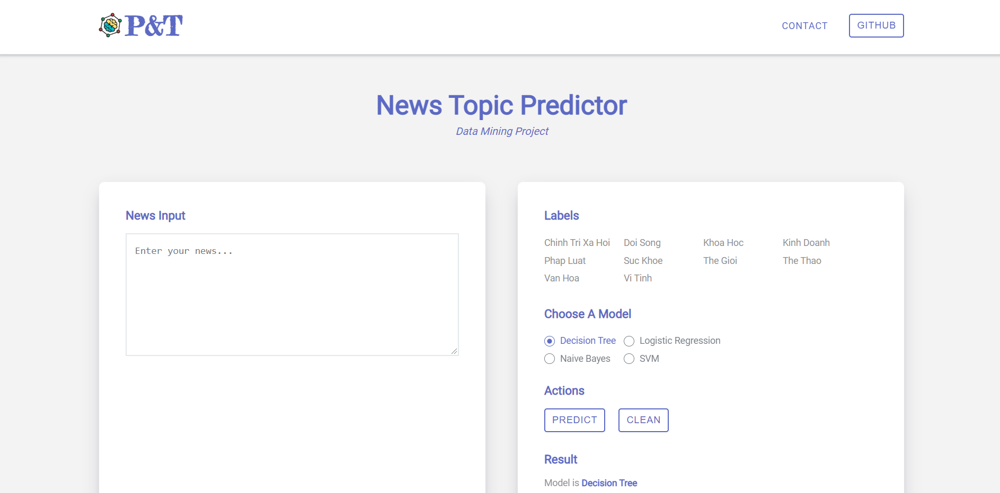

# News Topic Predictor App

## About

Building a text classification application to predict news of 10 topics. Our website uses built-in machine learning models of the sklearn library such as Decision Tree, Logistic Regression, Naive Bayes and SVM models.

**Link demo:** http://pred-news-topic.herokuapp.com/



## Description

### document folder

- Nguyen_Tan_Pil\_&_Nguyen_Thanh_Tam.docx file
- Nguyen_Tan_Pil\_&_Nguyen_Thanh_Tam.pdf file
- Nguyen_Tan_Pil\_&_Nguyen_Thanh_Tam.pptx file

### Install Back-End Requirements

```
  $ pip install -r requirements.txt
```

### Install Front-End Requirements

```
  $ cd client
  $ npm install
```

### Create venv in local

```
  $ python -m venv venv
```

### Run application in local with virtualenv

```
  $ venv\Scripts\activate
```

### Run Back-End

```
  $ py app.py
```

### Run Front-End

```
  $ cd client
  $ npm start
```

### Run

Open your browser to http://localhost:3000

## References

- Color: https://www.nyckel.com/?gclid=Cj0KCQiAwqCOBhCdARIsAEPyW9nQVPt1yJfrsad6Mr7nX9M-_qnXo_8TBCLh2iZ8ouVx-uOJJRoA9zcaAtGDEALw_wcB
- Tutorial: https://www.youtube.com/watch?v=h0zOsZLPvJY&t=1376s
